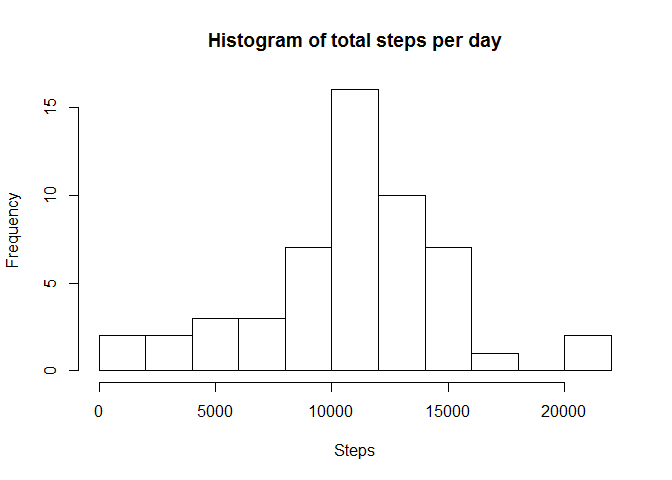
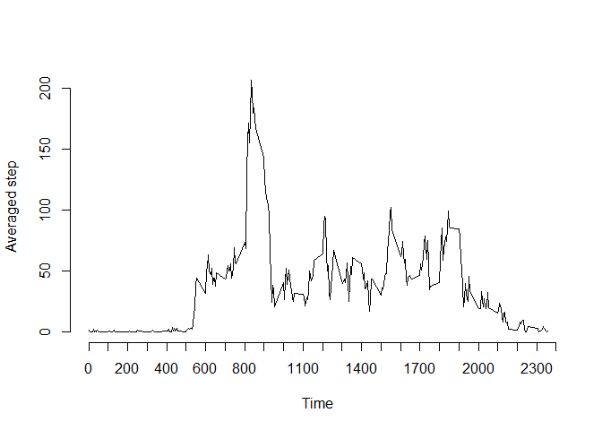
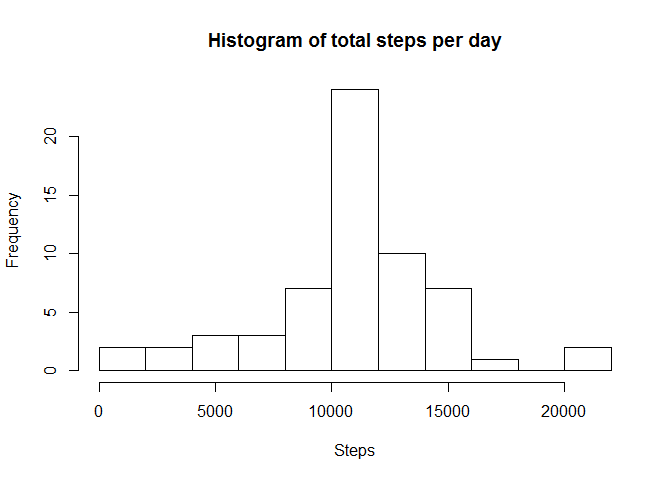
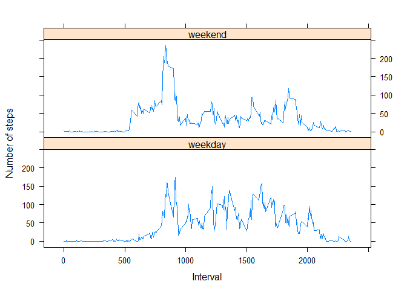

# Reproducible Research Assignment 1
##Loading and preprocessing the data


**Load the data (i.e. read.csv())**

I used read.csv() to load the data.


```r
Activity <- read.csv("activity.csv", sep=",",colClasses=c("numeric","character","numeric"))
```

**Process/transform the data (if necessary) into a format suitable for your analysis**

The initial loaded date column is not a date type, so I transformed it into one.


```r
Activity$date <- as.Date(Activity$date)
```


##What is mean total number of steps taken per day?


**Calculate the total number of steps taken per day**

I made a new data frame from the sum of steps in each date by the function tapply().


```r
stepList<-data.frame(tapply(Activity$steps, Activity$date, FUN=sum))
colnames(stepList)<-'steps'
stepList$date<-as.Date(row.names(stepList))
```

**Make a histogram of the total number of steps taken each day**

I drew a histogtam picture with 10 bins. 


```r
hist(stepList$steps, xlab="Steps", breaks=10, main="Histogram of total steps per day")
```

 

**Calculate and report the mean and median of the total number of steps taken per day**

I made a mean and median calculation without considering NA by using na.rm=TRUE.


```r
mean(stepList$steps,na.rm=TRUE)
```

```
## [1] 10766.19
```

```r
median(stepList$steps,na.rm=TRUE)
```

```
## [1] 10765
```

##What is the average daily activity pattern?

**Make a time series plot of the 5-minute interval (x-axis) and the average number of steps taken, averaged across all days (y-axis)**

I made another data frame about average steps in each interval by the function tapply() again.


```r
timeList<-data.frame(tapply(Activity$steps, Activity$interval, FUN=mean, na.rm=TRUE))
colnames(timeList)<-'interval'
```

I then drew another picture shows the average steps during a day.


```r
plot(row.names(timeList),timeList$interval,type="l", xlab="Time", ylab="Averaged step",las=3,axes=FALSE)
axis(side=1, at=seq(0, 2400, by=100))
axis(side=2, at=seq(0, 200, by=50))
```

 

**Which 5-minute interval, on average across all the days in the dataset, contains the maximum number of steps?**

I used the max() function to find out the interval which contains the maximum number of steps.


```r
Activity$interval[which.max(timeList$interval)[[1]]]
```

```
## [1] 835
```

The answer is the interval of 835.


##Imputing missing values

**Note that there are a number of days/intervals where there are missing values (NA). The presence of missing days may introduce bias into some calculations or summaries of the data.**

**Calculate and report the total number of missing values in the dataset (i.e. the total number of rows with NAs).**

I used is.na() to calculate the number.


```r
sum(is.na(Activity$steps))
```

```
## [1] 2304
```

**Devise a strategy for filling in all of the missing values in the dataset.**
**Create a new dataset that is equal to the original dataset but with the missing data filled in.**

I took the average of summed steps and distributed the number uniformly for all NA columns.


```r
newSteps<-Activity$steps
newSteps[is.na(Activity$steps)]<-mean(stepList$steps,na.rm=TRUE)/sum(Activity$date=="2012-10-01")
```

**Make a histogram of the total number of steps taken each day and calculate and report the mean and median total number of steps taken per day. Do these values differ from the estimates from the first part of the assignment? What is the impact of imputing missing data on the estimates of the total daily number of steps?**

I repeated similar steps as before to generate the desired picture. 


```r
newActivity<-data.frame(newSteps,Activity$date,Activity$interval)
colnames(newActivity)<-c("steps","date","interval")
newStepList<-data.frame(tapply(newActivity$steps, newActivity$date, FUN=sum))
colnames(newStepList)<-'steps'
newStepList$date<-as.Date(row.names(newStepList))
hist(newStepList$steps, xlab="Steps", breaks=10,main="Histogram of total steps per day")
```

 

I took the same function to calculate the mean and median values.


```r
mean(newStepList$steps,na.rm=TRUE)
```

```
## [1] 10766.19
```

```r
median(newStepList$steps,na.rm=TRUE)
```

```
## [1] 10766.19
```

The values is very close to what I got before, because I used the average to fill in NAs.

##Are there differences in activity patterns between weekdays and weekends?

**Create a new factor variable in the dataset with two levels - "weekday" and "weekend" indicating whether a given date is a weekday or weekend day.**

I introduced a new column called 'weekday', which uses the function weekdays() to determine if the date is in weekdays or not. 


```r
Activity$weekday <- weekdays(Activity$date)=="Sunday" | weekdays(Activity$date)=="Saturday" 
Activity$weekday[Activity$weekday=="TRUE"] <- "weekday"
Activity$weekday[Activity$weekday=="FALSE"] <- "weekend"
newTimeList<-data.frame(tapply(Activity$steps, list(Activity$interval,Activity$weekday), FUN=mean, na.rm=TRUE))
newTimeList$Interval<-as.numeric(row.names(newTimeList))
```

After applying tapply(), the resulted data frame is not I want for a tidy data. In order to change it, I introduced a package 'reshape' and melted the data frame down.


```r
library(reshape)
weekList<-melt(newTimeList,id="Interval")
```

**Make a panel plot containing a time series plot of the 5-minute interval (x-axis) and the average number of steps taken, averaged across all weekday days or weekend days (y-axis). See the README file in the GitHub repository to see an example of what this plot should look like using simulated data.**

For drawing the picture, I used the package 'lattice' and generated the corresponding picture.


```r
library(lattice) 
xyplot(value~Interval|variable,data=weekList,type="l",layout=c(1,2),ylab="Number of steps")
```

 
    
We can see that the patterns are different in different situations.


